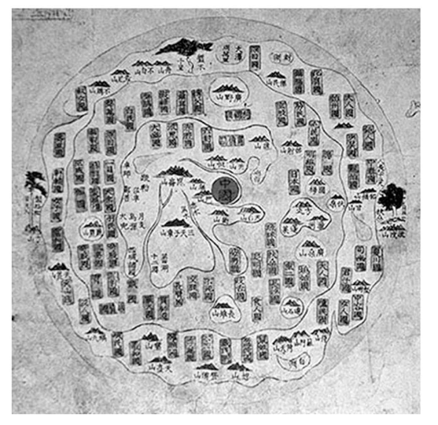
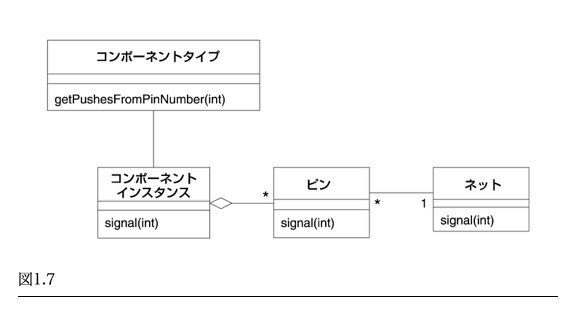
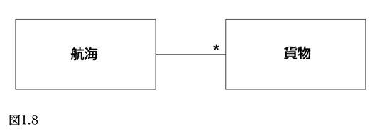
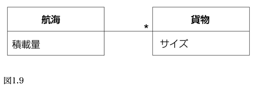
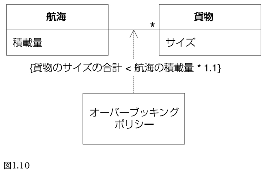

# エリック・エヴァンスのドメイン駆動設計

## 第１部　ドメインモデルを機能させる

### 〜 第１章 知識をかみ砕く 〜

2022/04/14

---

<style scoped>
  section { font-size: 200%; }
</style>

## 本日のまとめ

- ドメインモデルとはある目的に従って選びぬかれて抽象化されたもの。
  - 「写実的に」ではなく、ある目的に従って現実の「概要」を表現している
- ソフトウェアの核心は、ドメインに関係した問題をユーザーのために解決する能力である
  - 開発者はドメインモデリングを他人任せにせず、ソフトウェアの核心にある複雑さには真正面から立ち向かわなければならない
- 核心を探求するために知識のかみ砕きが必要であり、それは開発者とドメインエキスパートからなるチームが共同して行う
- プロジェクトから知識は流出していくものであるため、自分たちの知識を意識的に育てて、継続的学習を実践する必要がある

---

<style scoped>
  section { font-size: 200%; }
</style>

### 第１部　ドメインモデルを機能させる



---

- この図は誰に何を伝えようといるのか？
  - 国内に意識が向いていた当時の中国社会にとってはふさわしいものだった
  - 現代の中国にはまったく無意味だろう

---

- モデルとは簡素化である
  - 当面の問題を解決する上で関連する側面を抽象化し、それ以外の詳細を無視することによって行われた、現実に対する１つの解釈
  - 適切なモデルは情報の保つ意味を明らかにし、その情報を問題に集中させる
- ドメインモデルとは特定の図ではなく、図が伝えようとしている考え方
  - その知識が厳密に構成され、選びぬかれて抽象化されたもの

---

- ドメインモデリングはモデルをできるだけ「写実的に」作成することではない
  - 映画製作に近い
    - ある目的に従って現実の概要を表現している
    - 体験したことの側面のいくつかを選び出し、それらを独特な手法で提示することで、ストーリーを伝えたり意見を主張したりする
      - ドメインモデラも実用のために特定のモデルを選択する

---

<style scoped>
  section { font-size: 160%; }
</style>

#### ドメイン駆動設計におけるモデルの有用性

ドメイン駆動設計では、次に示すモデルの３つの基本的用法によって、どのモデルを選択するかが決定される

1. **モデルと設計の核心が相互に形成し合う**
   1. モデルと実装が密接に結びつくことによって、モデルに対する分析が最終成果物である実際に動くプログラムに適用されることが保証される
2. **モデルは、チームメンバー全員が使用する言語の基盤である**
   1. モデルと実装が結びついているので、開発者はプログラムについて話す際にこの言語を使える。通訳せずにドメインエキスパートと話せる
3. **モデルとは、蒸留された知識である**
   1. 議論の末に生成されたモデルを見ることで、我々がドメインについてどう考えることにしたかが分かる

こうしたやり方でモデルを使うことでソフトウェアの開発が支えられる。**その場しのぎ開発をすると、後から莫大な投資が必要となる**

---

#### ソフトウェアの核心

- **ソフトウェアの核心は、ドメインに関係した問題をユーザーのために解決する能力である**
  - それ以外の特徴はいずれも、この基本的な目的を支えるに過ぎない
- ドメインが複雑だと、問題を解決するのは難しい作業となる
  - 熟練した有能な人々が集中して取り組まなければならなくなる
    - **開発者は、ビジネスの知識を積み重ねるべく、モデリングスキルを研ぎ澄まし、ドメイン設計に精通することが要求される**

---

<style scoped>
  section { font-size: 200%; }
</style>

- 技術思考の開発者は、自分の専門スキルを発揮できる、定量化可能な問題を楽しむ傾向にある
  - ドメインに関する作業は面倒な上に、入り組んだ新しい知識を大量に必要とするが、それらはコンピュータ科学者としての能力を向上させるものではないように見える
- その代わり、複雑なフレームワークに取り組み、技術によってドメインの問題を解決しようとする
  - ドメインを学んだりモデリングしたりするのは他人に任せてしまう
- **しかし、ソフトウェアの核心にある複雑さには真正面から立ち向かわなければならない**
  - そうしなければ、的はずれなソフトウェアを作ってしまう危険がある

---

## 第１章　知識をかみ砕く

- 著者は過去にプリント基板（PCB: Printed-Circuit Board）設計用の専門ソフトウェアツールを設計することになった
- ソフトウェアがすべきことを PCB 設計者に正確に説明しようとしてもらったが、これがまずかった
  - ASCII ファイルを読み込み、それをソートした上で注釈をつけ、そして帳票を作成する・・・
  - 生産性の飛躍的向上につながらないことは明白だった
- 帳票に関する処理について、ドメインモデルの最初の要素を掴んだため、ドメインエキスパートの要求について図を描きながら一緒に話し始めた

---

〜〜〜 ドメインエキスパートへのインタビューのパート 〜〜〜

PCB 設計プロセスについて、最終的にできたモデル



---

- 得られたモデルを使って非常にシンプルなプロトタイプを作成した
  - DB も UI も省き、ふるまいだけに集中した
- 簡単なシミュレーションを実演することができた
  - Java オブジェクトにはドメインエキスパートと開発者が共有するモデルが反映されていた
- このプロトタイプが具体的であったことによって、モデルが何を意味し、実際に機能するソフトウェアにどう関係しているかを、ドメインエキスパートがより明確に理解できるようになった
  - **ドメインエキスパートは自身の考えを評価するための具体的なフィードバックをプロトタイプから得ていた**

---

### 効果的なモデリングの要素

1. モデルと実装を結びつける
2. モデルに基づいて言語を洗練させる
3. 知識豊富なモデルを開発する
   1. ふるまいや守るべきルールなど、モデルは様々な知識を保有する
4. モデルを蒸留する
   1. 核心ではないとわかった概念を取り除く
5. ブレインストーミングと実験を行う
   1. 生成したモデルを数多く試し、実際に使えるかどうかを判断する

---

<style scoped>
  section { font-size: 180%; }
</style>

### 知識のかみ砕き

- **有能なドメインモデラは知識をかみ砕き、情報の奔流の中に重要な一滴を探る**
  - 試行錯誤を経て、すべての詳細を解明する抽象概念が一式現れてくれば成功
  - ビジネスと最も関連の深いことが判明した特定の知識が、厳格に表現される
- 知識のかみ砕きは開発者とドメインエキスパートからなるチームが共同して行う
  - たいていは開発者が率いる
- 材料はドメインエキスパートの頭の中、既存システムのユーザー、関連するレガシーシステム、別プロジェクトメンバーの過去の経験、ドキュメント、話し合いなど
  - **初期バージョンやプロトタイプでの経験がチームにフィードバックされ、解釈が変わっていく**

---

- 旧来のウォーターフォール手法では、以下のようなフローを辿る
  - ビジネスエキスパートがアナリストに話をする
  - アナリストがかみ砕き抽象化する
  - その結果をソフトウェア製作者であるプログラマに伝える
- **このアプローチがうまくいかないのは、フィードバックが完全に欠如しているため**
  - 知識は一方向に少しずつ流れるだけで、蓄積されない

---

- 優秀なプログラマは、抽象化することからはじめ、より多くの処理ができるモデルを開発する
  - ただしドメインエキスパートとの共同作業がない場合、概念は素朴なものにしかならない
  - そのように作られたソフトウェアが、ドメインエキスパートの考え方と深く結びつくことはない

---

- チームメンバー間のやりとりは、メンバー全員がモデルを一緒にかみ砕くことで変化する
- ドメインモデルを絶えず改良すると、
  - 開発者はビジネスにおける重要な原理を習得するよう強いられ、**機会的に機能を作り出すことがなくなる**
  - ドメインエキスパートは自分の知っていることを蒸留して本質を抽出するよう強いられ、**ソフトウェアが必要とする概念の正確さを理解するようになる**

---

- **「このようなモデルは、決して完成することはない。代わりに、進化していくのだ。」**
- ドメインを解明するにあたって、モデルは実用的で役に立つものでなければならない
- アプリケーションがシンプルに実装され、理解しやすくなるように、モデルは厳密でなければならない

---

<style scoped>
  section { font-size: 180%; }
</style>

### 継続的学習

- ソフトウェアを書き始めるとき、我々は対象を十分に理解しているわけではない
  - 無知のせいで、誤った想定をしてしまう
- 一方、すべてのプロジェクトから知識は流出している
  - 何かを習得した人が他の人へ移動することにより、知識は断片化してしまう
- **高度に生産的なチームは、自分たちの知識を意識的に育てて、継続的学習を実践する**
  - ドメインモデリングのスキル、ドメイン知識、技術的な知識、・・・
- こうして自ら学んだチームメンバーは、最も重要な領域を含む開発に集中し、信頼できるコアとなっていく
  - **コアチームの頭の中に知識が蓄積されることで、彼らは知識をよりうまくかみ砕けるようになる**

---

- 本書内で扱った PCB 設計プロセスは結局開発とりやめとなった
  - とはいえ、初期の作業は不可欠だった
  - **知識のかみ砕きというプロセスを始動させ、それによって以降の全作業が効果的に行われた**
    - そもそも知識のかみ砕きがなければ、優先順位の把握ができず、開発中止の判断はできなかった
- **チームメンバー、開発者、ドメインエキスパートが同じように知識を得て、共有された言語が芽を出し、実装を通してフィードバックループが完結した**

---

### 知識豊富な設計

- エンティティや値を超えてその先に行こうとする、このような動きに伴ったときこそ、知識のかみ砕きは力を発揮できる
  - ビジネスルールの間に矛盾があるかもしれないため
- ドメインエキスパートは複雑なビジネスルールを知識や経験で脳内解決してしまっている
  - ソフトウェアにはできない
- **ドメインエキスパートと開発者が知識をかみ砕くことによって初めて、ルールが明確となり、実装できるか、スコープ対象外となるか判断される**

---

#### 例 1.1 - 隠された概念を引き出す

ある船の一回の航海に対して、貨物を運んでもらうように予約するアプリケーションの土台

- 予約アプリケーションの責務は、
  - 貨物（Cargo）
  - 航海（Voyage）
- を関連付け、その関係を記録し、追跡すること
- クラス図とコードは次のようになる

---



```java
public int makeBooking(Cargo cargo, Voyage voyage) {
  int confirmation = orderConfirmationSequence.next();
  voyage.addCargo(cargo, confirmation);
  return confirmation;
}
```

---

- 土壇場でのキャンセルを考慮し、輸送業界の慣習では、１回の航海でその船舶が運搬できる量より多くの貨物を受け入れる
  - これを「オーバーブッキング」という
  - これは輸送業界で働く人には常識だが、開発者が把握しているとは限らない
- 要求定義書の中には、次の一文が書かれている
  - 「10%のオーバーブッキングを認める」
- クラス図とコードは次のようになる

---



```java
public int makeBooking(Cargo cargo, Voyage voyage) {
  // 最大予約 = 航海の積載量 × 1.1
  double maxBooking = voyage.capacity() * 1.1;
  if ((voyage.bookedCargoSize() + cargo.size()) > maxBooking) {
    return -1;
  }
  int confirmation = orderConfirmationSequence.next();
  voyage.addCargo(cargo, confirmation);
  return confirmation;
}
```

---

<style scoped>
  section { font-size: 180%; }
</style>

- ここでは重要なビジネスルールがガード節としてアプリケーションメソッドの中に隠されている
  - （第４章で、オーバーブッキングのルールをドメインオブジェクトへ移す）
- 現状の問題
  - このままでは、たとえ開発者が手助けしても、ビジネスエキスパートがコードを読んで、ルールが正しいかどうかを検証できそうもない
  - ビジネスについて知らない技術者が、要求定義書の記述をコードと結びつけることは困難である
    - ルールがより複雑に慣れば、問題はさらに大きくなる
- この知識をより適切に捉えられるよう、設計を変更することができる
  - ポリシー（デザインパターンの１つ「[ストラテジー](https://qiita.com/i-tanaka730/items/4d00c884b7ce1594f42a)」の別名）を利用する
- クラス図とコードは次のようになる

---

<style scoped>
  section { font-size: 160%; }
</style>



```java
public int makeBooking(Cargo cargo, Voyage voyage) {
  //
  if (!overbookingPolicy.isAllowed(cargo, voyage)) return -1;
  int confirmation = orderConfirmationSequence.next();
  voyage.addCargo(cargo, confirmation);
  return confirmation;
}
```

```java
// OverbookingPolicy クラス内
public boolean isAllowed(Cargo cargo, Voyage voyage) {
  return (cargo.size() + voyage.bookedCargoSize()) <=
  (voyage.capacity() * 1.1);
}
```

---

- この変更によって起こった変化
  - 誰でもオーバーブッキングというポリシーを識別できるようになった
  - ルールの実装は明示的で独立した

---

<style scoped>
  section { font-size: 180%; }
</style>

- **ところで、筆者はこうした手の込んだ設計をドメインのあらゆる詳細に適用することを推奨しているわけではない**
  - （第 15 章「蒸留」では、重要なことに集中して、それ以外のものをすべて最小限にするか分離するための方法を掘り下げる）
- この輸送ドメインの例はあくまで、ドメインモデルとそれに対応する設計が、知識を確固たるものにして共有するのに使えることを示すために用いた
- より明示的な設計には次のような利点がある
  - この段階まで設計を進められる頃には、プログラマやその他の関係者の誰もが、オーバーブッキングの本質を、単なるわかりにくい計算ではなく、明確で重要なビジネスルールだと理解するようになっているだろう
  - プログラマは、ドメインエキスパートに技術的な成果物（コード含む）を見せることができる。ドメインエキスパートは（開発者の手助けがあれば）理解できるはずで、それによってフィードバックループが完結する

---

<style scoped>
  section { font-size: 180%; }
</style>

### 深いモデル

- **役立つモデルがすぐに見つかる表層にあることはめったにない**
  - ドメインとアプリケーションがやるべきことを理解するようになるにつれて、問題の核心を突くようなうまい抽象が現れてくる
- 貨物輸送サービスの例では、貨物の予約行為によって輸送が始まるため、貨物や輸送日程などを記述できるようにするモデルを開発した
  - より重要視されるのは、輸送日程の手配よりも、船荷証券などの法律書類や支払い免除に繋がるプロセスだった
- 輸送業に対する見方が深まったことにより、モデルは抜本的に変化した
  - 輸送に関する考え方は、コンテナをある場所から別の場所へ動かすことから、貨物に対する責任を、ある当事者から別の当事者へ移動することに変わった
- **「知識のかみ砕きは探求だから、最終的にどこへ行き着くかはわからないのだ」**

---

<style scoped>
  section { font-size: 200%; }
</style>

## 本日のまとめ

- ドメインモデルとはある目的に従って選びぬかれて抽象化されたもの。
  - 「写実的に」ではなく、ある目的に従って現実の「概要」を表現している
- ソフトウェアの核心は、ドメインに関係した問題をユーザーのために解決する能力である
  - 開発者はドメインモデリングを他人任せにせず、ソフトウェアの核心にある複雑さには真正面から立ち向かわなければならない
- 核心を探求するために知識のかみ砕きが必要であり、それは開発者とドメインエキスパートからなるチームが共同して行う
- プロジェクトから知識は流出していくものであるため、自分たちの知識を意識的に育てて、継続的学習を実践する必要がある

---

## Fin.
